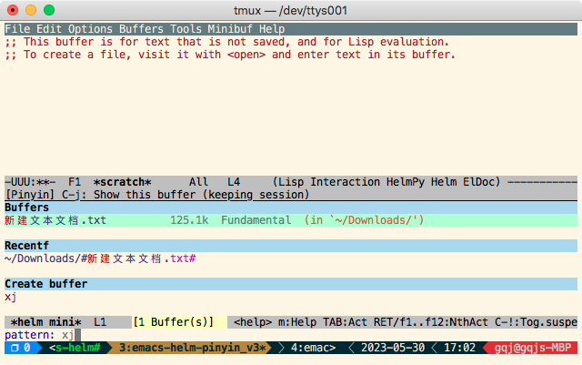
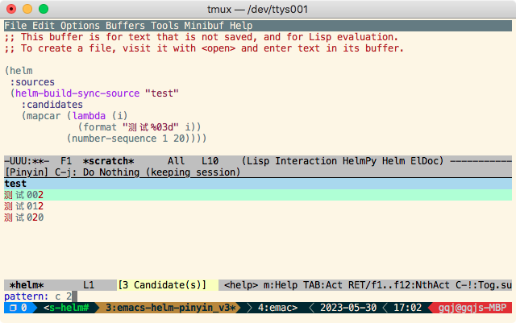

[](https://github.com/twlz0ne/helm-pinyin/actions?query=workflow%3ACI)

# helm-pinyin

Pinyin support for `helm-find-files` and `helm-mini`.

<p float="left" align="center">
  
  
</p>

## Installation

``` elisp
(quelpa '(helm-pinyin :repo "twlz0ne/helm-pinyin" :fetcher github))
```

## Usage

``` elisp
(require 'helm-pinyin)
(helm-pinyin-mode 1)

;; Apply pinyin matching on `completing-read`.
(add-to-list 'completion-styles-alist
             (cons 'helm-pinyin (cdr (assq 'helm completion-styles-alist))))
(setq helm-completion-style 'helm-pinyin)

;; (define-key helm-map (kbd "C-c ,")
;;             (lambda ()
;;               "Toggle helm-pinyin while helm window is activated."
;;               (interactive)
;;               (if helm-pinyin-mode
;;                   (helm-pinyin-mode -1)
;;                 (helm-pinyin-mode 1))
;;               (helm-refresh)))
```
